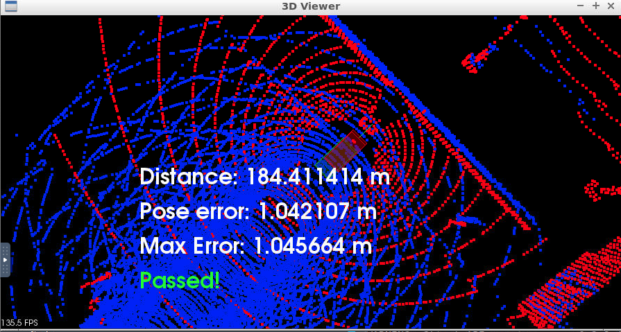

# Scan Match Localization.
## Setting
I develop `c3-main.cpp` to calculate localize using a simulator in Udacity workspace environment.

## Result
I implemented both ICP and NDT method to calculate scan matching localization.
The localizer using ICP worked and it was able to achieve the goal, but NDT. It was easy for me to adjust ICP parameters, because I could check correspond points cloud by using visualizer and adjusted parameter unit was distance (meter). 

The figure shows the result using ICP scan matching.

